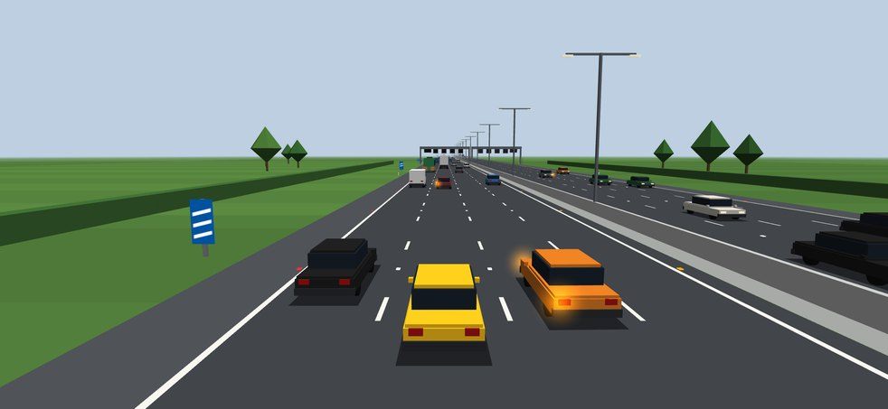
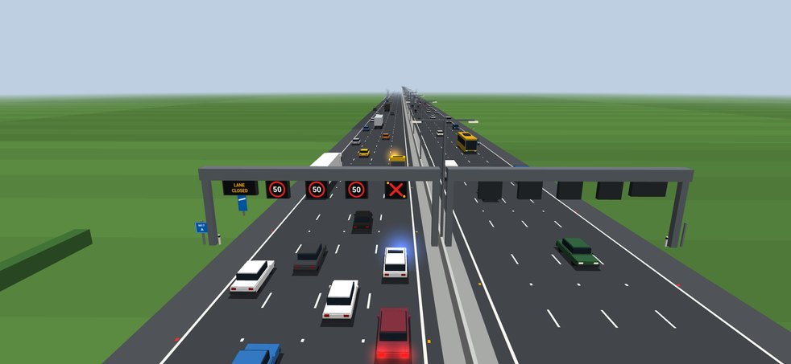
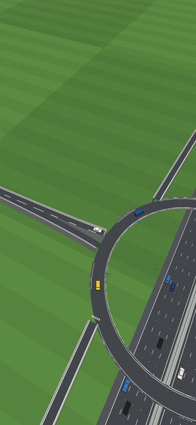
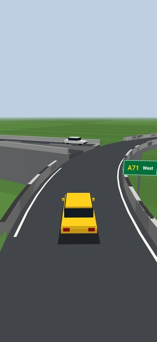

# 4 Lane Motorway Simulator

A 3D UK motorway driving and traffic simulator for **Android 17** (API level 37).

Drive a dual four-lane motorway in busy traffic. Leave at a junction, go round the
elevated roundabout, and join the other carriageway. When there's a breakdown or a
crash, police arrive to protect the scene and a recovery truck clears it. Every vehicle
is driven by a real traffic model, so you get queues, overtaking, phantom jams and merging.

| Motorway | Incident: police protecting a closed lane |
| --- | --- |
|  |  |

| Junction from above | On the roundabout |
| --- | --- |
|  |  |

## Features

### The road
- **Dual four-lane motorway** in 3D with hard shoulders and a central reservation with a
  concrete barrier and lighting columns.
- **UK road markings**: 2 m/7 m lane dashes and rumble strips. The cat's eyes are red
  at the hard shoulder, white between lanes, amber at the central reservation, and
  green where slip roads join.
- **Junctions every 3 km**, each with:
  - an exit (diverge) lane and a slip road climbing to an **elevated two-bridge roundabout**
    over the motorway;
  - entry slips and acceleration lanes onto both carriageways;
  - a local A-road on each side, with a turning loop at the far end.
- **Signs**:
  - advance direction signs;
  - 300/200/100 yard countdown markers;
  - driver location signs;
  - exit signs on the roundabouts.

### Traffic
- [Intelligent Driver Model](https://en.wikipedia.org/wiki/Intelligent_driver_model)
  car-following.
- MOBIL lane changing with a **keep-left** bias and **no undertaking** above 38 mph.
- **Zip merging**: drivers let others in.
- Lorries are banned from lane 4.
- Drivers **plan their exits**: they move left in good time, use the diverge lane, then
  **give way to the right** at the roundabout (circulating clockwise).
- Traffic joins from the slip roads and the local roads.
- Cars, vans, coaches and lorries, each with its own size, performance and speed limiter.

### Smart motorway gantries
- Variable speed limits from queue protection.
- A red X over closed lanes.
- Message signs: "QUEUE CAUTION", "INCIDENT AHEAD", "LANE CLOSED".
- Speed cameras that flash above the limit plus 10% plus 2 mph, with a 10 s grace
  period after the limit changes.

### Incidents, police and recovery
- Breakdowns happen at random, or you can trigger one with **Incident**.
- A police car with **blue lights** parks behind the incident to protect it. Traffic moves
  over to let it through.
- A **recovery truck** with amber beacons crawls past, pulls in ahead of the vehicle,
  reverses up to it and **winches it onto its flatbed**. Then it drives away and the lane
  reopens.
- **Crash recovery**: if you crash, the camera circles the scene while police and recovery
  deal with it. When your car is loaded onto the truck you carry on in a new car, or you
  can tap to carry on straight away.

### Driving
- Four camera views: chase, high, bonnet and helicopter.
- HUD:
  - speedometer and current limit sign;
  - a repeater for the next gantry;
  - a heading-up mini-map;
  - guidance for junctions and roundabouts.
- Four traffic levels, from Light to Rush hour.
- Works in any orientation and window size: phones, tablets, foldables and desktop windowing.

## Controls

| Action | Touch | Keyboard | Controller |
| --- | --- | --- | --- |
| Accelerate | hold **GAS** | ↑ / W | R2 |
| Brake | hold **BRAKE** | ↓ / S | L2 |
| Change lane / take exit | ◀ / ▶ | ← → / A D | L1 / R1 |
| Pause | Pause | Space / P | Start |
| Autopilot | Autopilot | O | Y |
| Traffic level | Traffic | T | X |
| Camera view | View | V | Select |
| Incident ahead | Incident | I | — |

- **Pedals**: if you release both, cruise control holds your current speed. Pressing GAS or
  BRAKE takes back control from autopilot.
- **Leaving the motorway**: get into lane 1 before the junction. The HUD counts down to it.
  In the diverge lane section, press **◀**.
- **Roundabout**: give way to traffic from the right. Once you're on it, **◀** takes the
  next exit (the HUD shows which one) and **▶** stays on. Take the exit for the other
  carriageway to turn back.
- **Joining**: on the acceleration lane, build up speed and press **▶** to merge.

## Building

Requirements: JDK 17+ and the Android SDK with `platforms;android-37.0`. You need a device
that supports OpenGL ES 3.0.

```sh
./gradlew assembleDebug          # → app/build/outputs/apk/debug/app-debug.apk
./gradlew testDebugUnitTest      # simulation unit tests
adb install app/build/outputs/apk/debug/app-debug.apk
```

Every push and pull request is built by GitHub Actions. You can download the debug APK
from the workflow run's artifacts.

- `compileSdk`/`targetSdk`: 37 (Android 17)
- `minSdk`: 30 (Android 11)

The app is plain Kotlin on the Android framework with OpenGL ES 3.0. It has no
third-party runtime dependencies.

## Code layout

```
app/src/main/java/com/johndoe6345789/motorwaysim/
├── MainActivity.kt
├── sim/                     pure-Kotlin traffic simulation (unit tested on the JVM)
│   ├── Road.kt              dimensions, lane numbering, junction spacing, UK rules
│   ├── Geometry.kt          3D paths with arc length and curve speed advice
│   ├── Network.kt           motorway links, slip roads, roundabouts, local roads
│   ├── Vehicle.kt           vehicle types, roles and per-vehicle state
│   ├── Idm.kt               Intelligent Driver Model
│   ├── Simulation.kt        driving, lane changes, give-way, routing, spawning, gantries
│   └── Incidents.kt         breakdowns and crashes, police and recovery response
├── render/                  3D rendering
│   ├── Scene3D.kt           camera and per-frame draw lists (pure Kotlin)
│   ├── WorldMeshes.kt       motorway, junction and scenery geometry
│   ├── VehicleModels.kt     low-poly vehicle models
│   ├── SignAtlas.kt         sign faces drawn with the Android canvas into a texture
│   ├── Mesh.kt, Mat4.kt     mesh building and matrices
│   ├── Shaders.kt           GLSL ES 3.00 shaders
│   └── GlRenderer.kt        OpenGL ES 3 backend
└── ui/
    ├── GameView.kt          GL surface + HUD, touch/keyboard/controller input
    ├── GameRenderer.kt      game loop on the GL thread
    ├── HudState.kt          per-frame HUD snapshot (thread-safe hand-off)
    └── Hud.kt               HUD and on-screen controls
```

The screenshots above are real frames from the app: the actual scene meshes, camera
matrices and shaders, rendered with WebGL 2, which uses the same GLSL ES 3.00 as
OpenGL ES 3.
