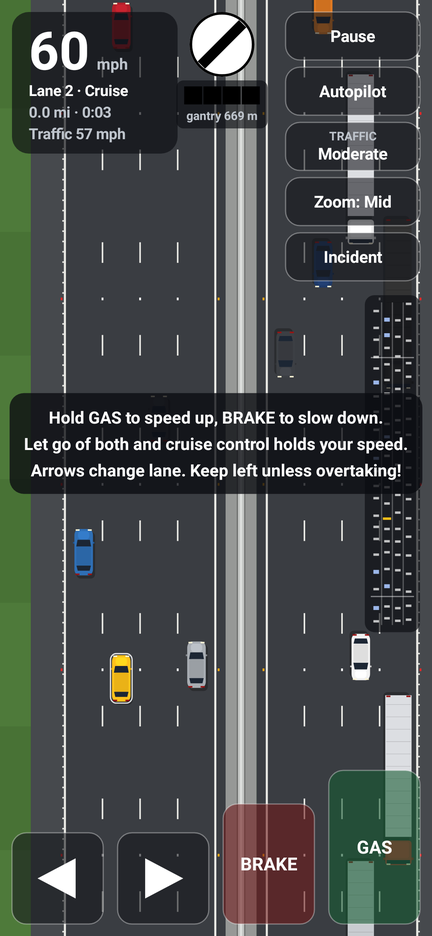
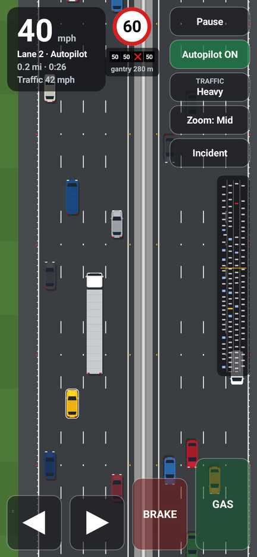
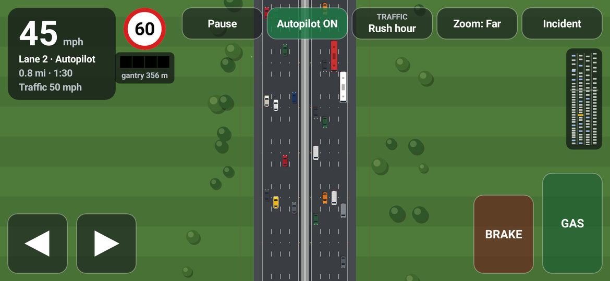

# 4 Lane Motorway Simulator

A top-down UK motorway driving and traffic simulator for **Android 17** (API level 37).

Drive along a four-lane carriageway in busy traffic, or switch on autopilot and watch
the traffic flow. Every vehicle is driven by a real traffic model, so you get
realistic queues, overtaking, phantom traffic jams and lane-closure merges.

| Portrait | Incident ahead | Landscape (rush hour, zoomed out) |
| --- | --- | --- |
|  |  |  |

## Features

- **Four-lane carriageway** with hard shoulder, central reservation and an opposite
  carriageway full of oncoming traffic. UK markings include 2 m/7 m lane dashes, rumble
  strips and red/white/amber cat's eyes.
- **Realistic traffic AI**:
  - [Intelligent Driver Model](https://en.wikipedia.org/wiki/Intelligent_driver_model)
    for car-following.
  - MOBIL lane changing with a **keep-left** bias.
  - A **no-undertaking** rule above 38 mph.
  - **Zip merging**, where drivers let others in.
- **Mixed traffic**: cars, vans, coaches and lorries, each with its own size,
  acceleration and speed limiter. Lorries are banned from lane 4, as on UK motorways.
- **Smart motorway gantries** every kilometre:
  - Variable speed limits from queue protection.
  - A red X over closed lanes.
  - Message signs ("QUEUE CAUTION", "INCIDENT AHEAD", "LANE CLOSED").
- **Incidents**: breakdowns randomly close a lane, and you can trigger one with the
  **Incident** button.
- **Speed cameras** on the gantries. They flash if you go over the limit plus 10% plus
  2 mph, with a 10 s grace period after a limit changes.
- **HUD**: speedometer, current limit sign, a repeater for the next gantry, and a traffic
  radar covering 1.35 km of road.
- **Four traffic levels** (Light, Moderate, Heavy, Rush hour) and **three zoom levels**.
- Works in **any orientation and window size**: phones, tablets, foldables and desktop
  windowing. Android 17 no longer lets large-screen apps opt out of resizing.

## Controls

| Action | Touch | Keyboard | Controller |
| --- | --- | --- | --- |
| Accelerate | hold **GAS** | ↑ / W | R2 |
| Brake | hold **BRAKE** | ↓ / S | L2 |
| Change lane | ◀ / ▶ | ← → / A D | L1 / R1 |
| Pause | Pause | Space / P | Start |
| Autopilot | Autopilot | O | Y |
| Traffic level | Traffic | T | X |
| Zoom | Zoom | Z | Select |
| Incident ahead | Incident | I | — |

If you release both pedals, cruise control holds your current speed. Pressing GAS, BRAKE
or a lane button takes back control from autopilot. After a crash, tap anywhere to restart.

## Building

Requirements: JDK 17+ and the Android SDK with `platforms;android-37.0`.

```sh
./gradlew assembleDebug          # → app/build/outputs/apk/debug/app-debug.apk
./gradlew testDebugUnitTest      # traffic-model unit tests
adb install app/build/outputs/apk/debug/app-debug.apk
```

Every push and pull request is built by GitHub Actions. You can download the debug APK
from the workflow run's artifacts.

- `compileSdk`/`targetSdk`: 37 (Android 17)
- `minSdk`: 30 (Android 11)

The app is plain Kotlin on the Android framework, built with Android Gradle Plugin 9 and
its built-in Kotlin support. It has no third-party runtime dependencies.

## Code layout

```
app/src/main/java/com/johndoe6345789/motorwaysim/
├── MainActivity.kt          full-screen activity hosting the game view
├── sim/                     pure-Kotlin traffic simulation (unit tested on the JVM)
│   ├── Road.kt              geometry, lane numbering and UK rules
│   ├── Vehicle.kt           vehicle types and per-vehicle state
│   ├── Idm.kt               Intelligent Driver Model
│   └── Simulation.kt        lane changing, spawning, gantries, incidents, cameras
└── ui/
    ├── MotorwayView.kt      frame loop and touch/keyboard/controller input
    ├── Camera.kt            world → screen mapping
    ├── SceneRenderer.kt     road, scenery, gantries and vehicles
    ├── OncomingTraffic.kt   scenery traffic on the other carriageway
    └── Hud.kt               HUD, on-screen controls and overlays
```
