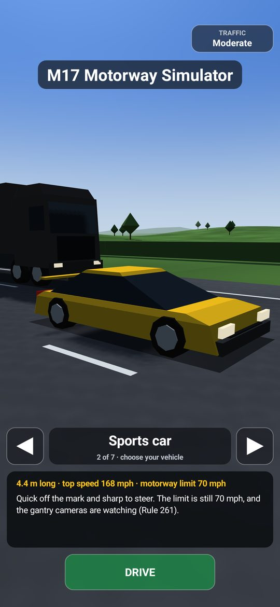
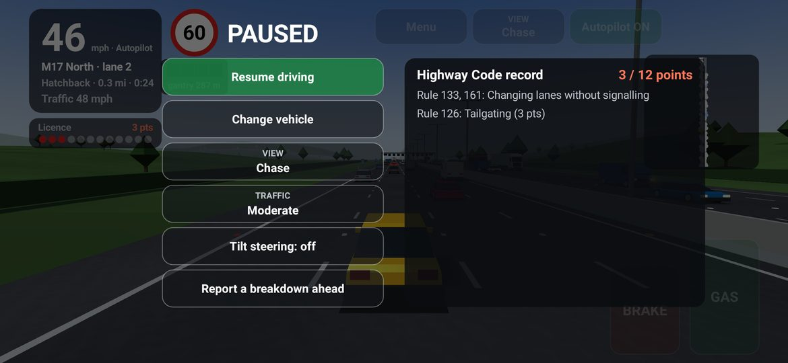
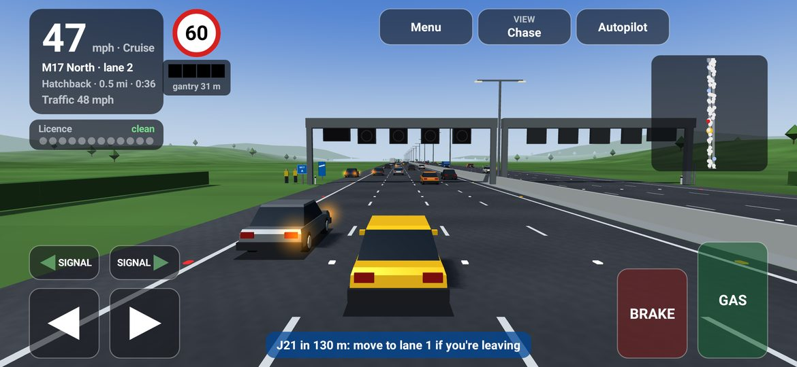
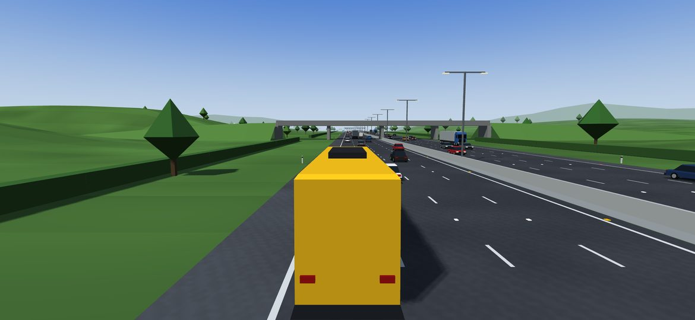
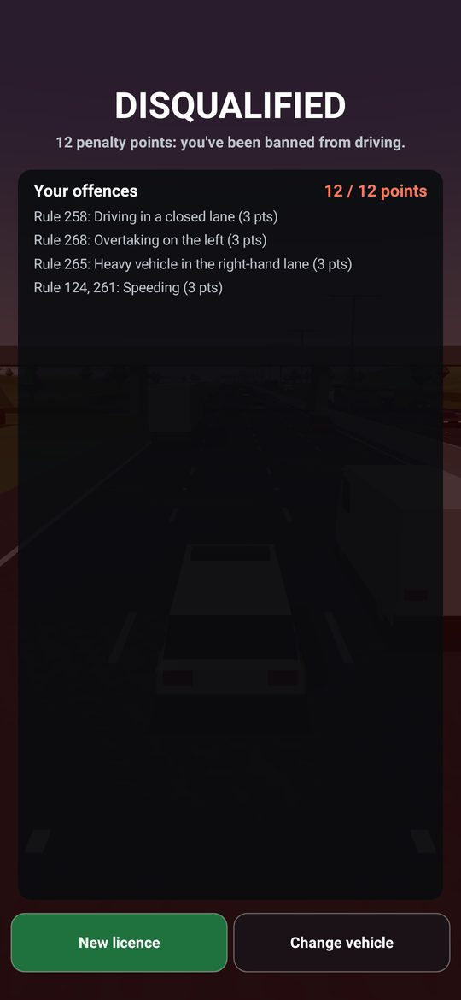

# 4 Lane Motorway Simulator

A 3D UK motorway driving and traffic simulator for **Android 17** (API level 37).

Pick a vehicle and drive it yourself on a dual four-lane motorway in busy traffic. You can
drive a hatchback, sports car, van, coach, HGV, police car or recovery truck. Steer freely
between lanes, leave at a junction, go round the elevated roundabout and join the other
carriageway. Your driving is judged against the **UK Highway Code**: break a rule and you
get the rule number and penalty points, and 12 points means a ban. The AI traffic follows
the same rules: it keeps left, signals before it moves, keeps its distance, and its
coaches and HGVs stay out of lane 4.

| Choose your vehicle | Driving an HGV: signal on, approaching a junction |
| --- | --- |
|  |  |

| Highway Code record (pause menu) | Breakdown on the hard shoulder: occupants behind the barrier |
| --- | --- |
|  |  |

| Police protecting a closed lane (red X, 50 mph) | On the roundabout |
| --- | --- |
|  |  |

| Overbridge, from a coach | Disqualified |
| --- | --- |
|  |  |

## Features

### Vehicles

| Vehicle | Motorway limit | Lane 4 | Notes |
| --- | --- | --- | --- |
| Hatchback | 70 mph | yes | |
| Sports car | 70 mph | yes | quick, sharp steering |
| Van | 70 mph | yes | slow to pick up speed |
| Coach | 60 mph (Rule 124) | no (Rule 265) | 12.5 m long |
| HGV | 60 mph (Rule 124) | no (Rule 265) | 16.5 m artic, long stopping distance |
| Police car | 70 mph | yes | blue lights; you're sent to breakdowns |
| Recovery truck | 60 mph | no | amber beacons; you clear breakdowns |

Each vehicle has its own size, power, braking, wheelbase and steering, and a low-poly 3D
model with wheels, glass, lights and livery. The **garage** shows your choice turning
slowly at the side of the motorway while traffic goes past.

- **Police car**: control sends you to breakdowns. Get there with the blue lights on and
  stop behind the vehicle to protect it. A recovery truck is then sent. Traffic lets you
  through (Rule 219).
- **Recovery truck**: pull in ahead of the broken-down vehicle and stop. The truck
  reverses up and winches it aboard. Then build up speed, signal and rejoin (Rule 278).

If you don't respond, or you switch on autopilot, an AI crew takes the job.

### The Highway Code

Rule numbers are from the current edition on GOV.UK.

| Offence | Rule | Points |
| --- | --- | --- |
| Speeding: over the limit for the road or your vehicle | 124, 261 | 3 |
| Caught by a gantry speed camera | 124, 261 | 3 |
| Driving under a red X | 258 | 3 |
| Tailgating: under one second behind at speed (half the two-second gap) | 126 | 3 |
| Overtaking on the left | 268 | 3 |
| Hogging a middle or outside lane when the lane to your left is clear | 264 | 3 |
| Coach or HGV in the right-hand lane | 265 | 3 |
| Driving on the hard shoulder | 269 | 3 |
| Cutting in, so the driver behind brakes hard | 267 | 3 |
| Forcing your way on from a slip road | 259 | 3 |
| Not giving way at a roundabout | 185 | 3 |
| Collision | 126, 260 | 3 |
| Changing lanes without signalling | 133, 161 | advice |
| Leaving without signalling | 273 | advice |
| Stopping on the carriageway | 271 | advice |
| Blocking an emergency vehicle | 219 | advice |

- **Warnings first**: you get a warning before most offences are booked, such as "Slow
  down" or "Too close".
- **Exemptions**: police on blue lights, and recovery trucks at work, are exempt where the
  real rules allow it.
- **Your record**: the pause menu lists every offence with its rule.
- **Ban**: at 12 points you're disqualified and need a new licence.

The AI traffic follows the same rules:
- Mirrors–signal–manoeuvre: it signals before changing lane, normally for 1.5 s (133, 161, 163).
- It keeps a personal headway of about two seconds (126) and keeps left unless overtaking (264).
- It won't overtake on the left (268) or cut in (267).
- It moves over for vehicles stopped on the hard shoulder (264).
- It signals left before its exit (273) and at roundabouts (186).
- It flashes hazard lights to warn of a queue ahead (116).
- Coaches and HGVs keep to 60 mph and out of lane 4 (124, 265).
- Broken-down drivers go left onto the hard shoulder and wait behind the barrier (275–277).

### The road
- **Dual four-lane motorway** in 3D with hard shoulders and a central reservation with a
  concrete barrier and lighting columns.
- **UK road markings**: 2 m/7 m lane dashes and rumble strips. The cat's eyes are red
  at the hard shoulder, white between lanes, amber at the central reservation, and
  green where slip roads join.
- **Junctions every 3 km**, each with:
  - an exit (diverge) lane and a slip road climbing to an **elevated two-bridge roundabout**
    over the motorway;
  - entry slips and acceleration lanes onto both carriageways;
  - a local A-road on each side, with a turning loop at the far end.
- **Signs**:
  - advance direction signs;
  - 300/200/100 yard countdown markers;
  - driver location signs;
  - exit signs on the roundabouts.

### Traffic
- [Intelligent Driver Model](https://en.wikipedia.org/wiki/Intelligent_driver_model)
  car-following.
- MOBIL lane changing with a **keep-left** bias and **no undertaking** above 38 mph.
- **Zip merging**: drivers let others in.
- Coaches and HGVs are banned from lane 4.
- Drivers **plan their exits**: they move left in good time, use the diverge lane, then
  **give way to the right** at the roundabout (circulating clockwise).
- Traffic joins from the slip roads and the local roads.
- Hatchbacks, sports cars, vans, coaches and HGVs, each with its own size, performance and speed limiter.

### Smart motorway gantries
- Variable speed limits from queue protection.
- A red X over closed lanes.
- Message signs: "QUEUE CAUTION", "INCIDENT AHEAD", "LANE CLOSED".
- Speed cameras that flash above the limit plus 10% plus 2 mph, with a 10 s grace
  period after the limit changes.

### Incidents, police and recovery
- Breakdowns happen at random, or you can report one ahead from the pause menu. Most of
  them pull onto the hard shoulder, and the occupants wait behind the barrier. The rest
  stop in a live lane.
- A police car with **blue lights** parks behind the incident to protect it. Traffic moves
  over to let it through.
- A **recovery truck** with amber beacons crawls past, pulls in ahead of the vehicle,
  reverses up to it and **winches it onto its flatbed**. Then it drives away and the lane
  reopens.
- **Crash recovery**: if you crash, the camera circles the scene while police and recovery
  deal with it. When your vehicle is loaded onto the truck you carry on in a new one, or you
  can tap to carry on straight away.

### 3D world
- Real-time **sun shadows** (shadow mapping) and a gradient sky with haze.
- **Rolling hills** with hedgerows, copses and distant hills. Specular highlights on
  paintwork and glass, and textured asphalt.
- Overbridges between junctions, lighting columns, gantries, and an elevated roundabout
  on bridges.
- Four camera views: chase, high, bonnet and helicopter. The field of view widens with speed.

### Driving
- **Free steering** with a bicycle-model vehicle. Every vehicle has a different
  wheelbase, and lock reduces with speed. Brush the barrier and you scrape along it.
- **Indicators** that cancel themselves once you've changed lane.
- **Tilt steering** (optional), using the device's gravity sensor.
- **Autopilot** hands the wheel to the AI driver at any time.
- HUD:
  - speed, the limit for your vehicle, and a repeater for the next gantry;
  - licence points;
  - a heading-up mini-map;
  - guidance for junctions and roundabouts, with Highway Code rule references;
  - your current police or recovery job.
- Four traffic levels, from Light to Rush hour.
- Works in any orientation and window size: phones, tablets, foldables and desktop windowing.

## Controls

| Action | Touch | Keyboard | Controller |
| --- | --- | --- | --- |
| Accelerate | hold **GAS** | ↑ / W | R2 |
| Brake | hold **BRAKE** | ↓ / S | L2 |
| Steer | hold **◀ / ▶** (or tilt) | ← → / A D | D-pad |
| Indicate left / right | **SIGNAL** buttons | Q / E | L1 / R1 |
| Blue lights / beacons | Lights button | L | — |
| Menu (pause) | Menu | Space / P / Esc | Start |
| Autopilot | Autopilot | O | Y |
| Camera view | View | V | Select |
| Traffic level | pause menu | T | X |
| Change vehicle | pause menu | G | — |
| Report a breakdown ahead | pause menu | I | — |

- **Pedals**: if you release both, cruise control holds your current speed. Pressing GAS or
  BRAKE takes back control from autopilot.
- **Changing lane**: signal first, then steer. Without a signal you're reminded of
  Rules 133 and 161.
- **Leaving the motorway**: get into lane 1 before the junction (the HUD counts down to
  it). Signal left, then steer into the exit lane before it splits off.
- **Roundabout**: give way to traffic from the right. Keep to the outside (left) to take the
  next exit (the HUD shows which one), or the inside to go round. Take the exit for the
  other carriageway to turn back.
- **Joining**: on the acceleration lane, build up speed, signal right and steer into lane 1
  when there's a gap.
- **Garage**: ◀ ▶ (or ← →) browse the vehicles, and DRIVE (or Enter) starts.

## Building

Requirements: JDK 17+ and the Android SDK with `platforms;android-37.0`. You need a device
that supports OpenGL ES 3.0.

```sh
./gradlew assembleDebug          # → app/build/outputs/apk/debug/app-debug.apk
./gradlew testDebugUnitTest      # simulation unit tests
adb install app/build/outputs/apk/debug/app-debug.apk
```

Every push and pull request is built by GitHub Actions. You can download the debug APK
from the workflow run's artifacts.

- `compileSdk`/`targetSdk`: 37 (Android 17)
- `minSdk`: 30 (Android 11)

The app is plain Kotlin on the Android framework with OpenGL ES 3.0. It has no
third-party runtime dependencies.

## Code layout

```
app/src/main/java/com/johndoe6345789/motorwaysim/
├── MainActivity.kt
├── sim/                     pure-Kotlin traffic simulation (unit tested on the JVM)
│   ├── Road.kt              dimensions, lane numbering, junction spacing, UK rules
│   ├── Geometry.kt          3D paths with arc length and curve speed advice
│   ├── Network.kt           motorway links, slip roads, roundabouts, local roads
│   ├── Vehicle.kt           vehicle types, roles and per-vehicle state
│   ├── Idm.kt               Intelligent Driver Model
│   ├── Simulation.kt        driving, steering, lane changes, give-way, routing, spawning, gantries
│   ├── HighwayCode.kt       offences, rules and penalty points for the player's driving
│   └── Incidents.kt         breakdowns and crashes, police and recovery response
├── render/                  3D rendering
│   ├── Scene3D.kt           camera and per-frame draw lists (pure Kotlin)
│   ├── WorldMeshes.kt       motorway, junction, bridge and scenery geometry
│   ├── Terrain.kt           rolling countryside height field
│   ├── VehicleModels.kt     low-poly vehicle models
│   ├── SignAtlas.kt         sign faces drawn with the Android canvas into a texture
│   ├── Mesh.kt, Mat4.kt     mesh building and matrices
│   ├── Shaders.kt           GLSL ES 3.00 shaders: lighting, shadows, sky, signs, glows
│   └── GlRenderer.kt        OpenGL ES 3 backend with a shadow-map pass
└── ui/
    ├── GameView.kt          GL surface + HUD, touch/keyboard/controller/tilt input
    ├── GameRenderer.kt      game loop and screens (garage, driving, menu, ban) on the GL thread
    ├── HudState.kt          per-frame HUD snapshot (thread-safe hand-off)
    └── Hud.kt               HUD, menus and on-screen controls
```

The screenshots above are real frames from the app. The 3D scene is the actual meshes,
camera and shadow matrices and shaders, rendered with WebGL 2, which uses the same
GLSL ES 3.00 as OpenGL ES 3. The HUD is the app's own `Hud` drawn with the Android canvas.
